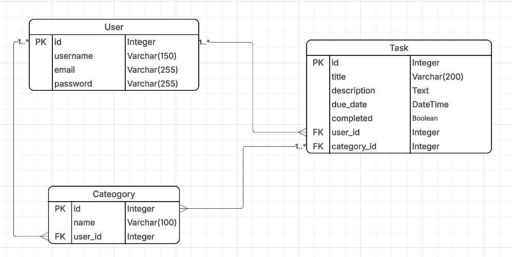

# 📝 Django To-Do List Application  

A full-stack **Django web application** that allows users to create, manage, and track their tasks.  
Built as part of the **Code Institute Full-Stack Software Development Program**.  

  
  
  
  

---

## 📑 Table of Contents
- [🎯 Project Goals](#-project-goals)  
- [💡 User Experience (UX)](#-user-experience-ux)  
  - [User Stories](#user-stories)  
  - [Wireframes](#wireframes)  
- [🗄️ Database Design](#%EF%B8%8F-database-design)  
- [📌 Agile Methodology](#-agile-methodology)  
- [✨ Features](#-features)  
- [🎨 Front-End Design](#-front-end-design)  
- [🛠️ Technologies Used](#%EF%B8%8F-technologies-used)  
- [🚀 Deployment](#-deployment)  
- [🧪 Testing](#-testing)  
- [🔮 Future Enhancements](#-future-enhancements)  
- [🙏 Credits](#-credits)  

---

## 🎯 Project Goals
- ✅ Provide a **simple, user-friendly platform** to manage personal tasks.  
- ✅ Ensure **accessibility, responsiveness, and good UX**.  
- ✅ Demonstrate **full-stack Django development**.  
- ✅ Apply **Agile methodology** for planning and delivery.  

---

## 💡 User Experience (UX)

### 👤 User Stories
- As a user, I want to **create a task** so I can track my to-dos.  
- As a user, I want to **mark tasks as completed** so I can monitor progress.  
- As a user, I want to **edit or delete tasks** so I can keep my list up to date.  
- As a user, I want to **filter tasks by category or priority** so I can focus on what matters.  
- As a user, I want to **see overdue tasks highlighted** so I don’t miss deadlines.  

## 🖼️ Wireframes
The following wireframes were created using Balsamiq to illustrate the planned design for desktop, tablet, and Android mobile layouts.

All wireframe PNGs are stored in `/docs/wireframes/`.

### Home Page
**Desktop**  **Tablet**  **Android**  ### Task List Page **Desktop**  **Tablet**  **Android**  ### Edit Task Page **Desktop**  **Tablet**  **Android**  ### Login Page **Desktop**  **Tablet**  **Android** 

---

## Database Design

The To-Do List application uses a relational database designed with three main entities:

- **User**: Stores user account details.
- **Task**: Represents tasks created by a user, linked to categories.
- **Category**: Groups tasks into categories for better organization.

### Entity-Relationship Diagram (ERD)

---

## 📌 Agile Methodology
- Agile planning and task tracking via a **GitHub Project Board**.  
- Columns: *Backlog*, *In Progress*, *Done*.  
- Issues represent **user stories** and are linked to commits.  
- Screenshots of the board will be included in `/docs/agile-board.png`.  

---

## ✨ Features
- 🔐 User authentication (register, login, logout).  
- ➕ Add, ✏️ Edit, ❌ Delete, and ✅ Complete tasks (CRUD).  
- 🔎 Filter and search tasks.  
- 📱 Responsive UI with Bootstrap.  
- ♿ Accessibility checked against **WCAG guidelines**.  

---

## 🎨 Front-End Design
- 🧭 Navigation bar with key links.  
- 📐 Responsive layout using Bootstrap Grid/Flexbox.  
- 🏷️ Semantic HTML (`header`, `main`, `nav`, `footer`).  
- 🎨 Accessible colors and contrast.  

---

## 🛠️ Technologies Used
- [Django](https://www.djangoproject.com/) (Python framework)  
- [SQLite / PostgreSQL](https://www.postgresql.org/) (database)  
- [Bootstrap 5](https://getbootstrap.com/) (CSS framework)  
- HTML5, CSS3, JavaScript  
- Git & GitHub (version control)  
- Heroku / Render (deployment)  

---

## 🚀 Deployment
Deployment instructions will include:  
1. Clone the repository  
2. Create and activate a virtual environment  
3. Install dependencies from `requirements.txt`  
4. Set up environment variables  
5. Run migrations  
6. Start the server  

---

## 🧪 Testing
- ✅ Unit tests for models, views, forms  
- ✅ Manual testing for all user stories  
- ✅ Accessibility testing (Lighthouse, WAVE)  
- ✅ Responsiveness on multiple devices  

---

## 🔮 Future Enhancements
- 📧 Task reminders via email notifications  
- 📂 Categories as a separate model  
- ↔️ Drag-and-drop task ordering  
- ⚡ AJAX for smoother interactions  

---

## 🙏 Credits
- Developed by Rehan Iqbal  
- Part of the **Code Institute Full-Stack Software Development** course.  

